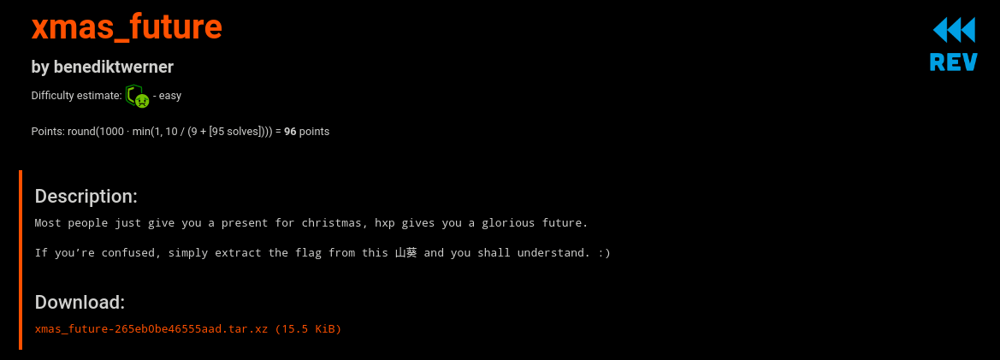
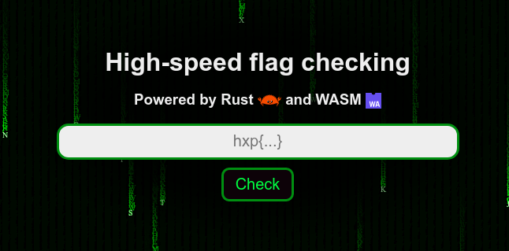
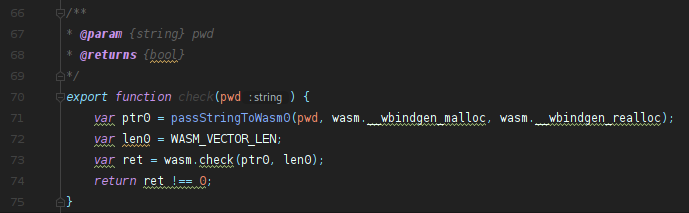
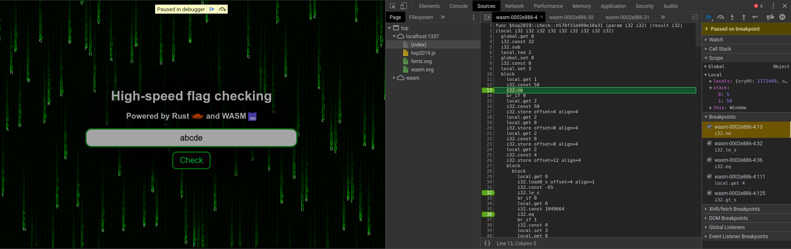
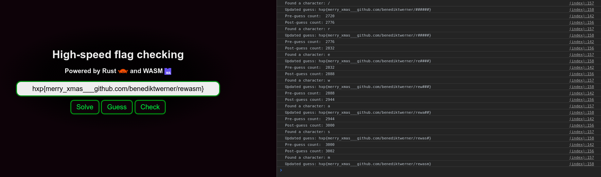

# xmas\_future

Author: benediktwerner

## Challenge Description

> Most people just give you a present for christmas, hxp gives you a glorious future.
>
> If you’re confused, simply extract the flag from this 山葵 and you shall understand. :)

## Write-up

Starting off: we get a tarball with a web page and some assets, which includes a WASM file and some supporting Javascript.

    $ tar tf xmas_future-265eb0be46555aad.tar.xz 
    xmas_future/
    xmas_future/run.sh
    xmas_future/index.html
    xmas_future/hxp2019_bg.wasm
    xmas_future/hxp2019.js
    xmas_future/ferris.svg
    xmas_future/wasm.svg

When we open the page in a browser, we are presented with a single input field and button to check the flag.

From reading through the included Javascript file, it seems like all of the checking happens in WASM, and the rest of the JS is probably just glue generated by bindgen.
The most interesting function that's exported by WASM is the check function. It seems that the WASM implementation is a function that accepts a pointer and length to our supplied password.

After skimming through the files, I also asked Google to translate the Chinese-looking term from the flavor text (山葵), which came up with Wasabi.
As it turns out, that's the name of a [WASM instrumentation framework](http://wasabi.software-lab.org), which is way too big of a coincidence to be an accident.
By using it to instrument `hxp2019_bg.wasm`, we can count the number of WASM instructions run, which in turn gives us a rough idea of how many characters in our flag are correct.
In theory, this lets us incrementally recover a flag character-by-character, assuming we're not up against some constant-time string comparison.

To check how workable this strategy would be, I started reversing the WASM stuff.
It seemed like the `check(i32, i32)` method was more glue, and that the inner call to `hxp2019::check::h578f31d490e10a31(i32, i32)` was the real money function.
I started checking a few placeholder strings and probing values at a few branch points.

Through a bit trial-and-error, I found that the flag length was likely 50 chars, and started with `hxp{m`.
In hindsight, the flag length should have been obvious from the length attribute on the input box.

While stepping through the code, it became clear that check function was indeed iterating character-by-character, which meant that the side-channel attack should be feasible.
Luckily for us, Wasabi even includes an example analysis that counts the number of instructions executed.

All that's left for us to do is to write a flag guesser, feed those values into the instrumented WASM checker, then use the instruction counter to guide the guesser.
By completing that feedback loop, we should be able to reduce the number of guesses necessary to around O(2000) tries.

To do all that, we can write some simple Javascript and insert it into the index.html file that comes from the challenge tarball. The most relevant files are linked below:

* [index.html](./solution/index.html) - Modified to pull in Wasabi bindings, instruction-counting Wasabi analysis, and our custom flag guesser. Also slightly widened the text box to make the whole flag visible at once.
* [hxp2019\_bg.wasabi.js](./solution/hxp2019_bg.wasabi.js) - Generated by Wasabi. Needed a [slight modification](./solution/hxp2019_bg.wasabi.js#L283-L285) to check for undefined Wasabi.analysis.memory objects before attempting to call grow.
* [instruction-count.js](./solution/instruction-count.js) - A Wasabi analysis that counts the number of hits per WASM instruction. Straight out of the Wasabi repo.

After running our flag guesser, we end up with the complete and correct flag:

## Closing thoughts

I wasn't planning on submitting a write-up, but it looked like a bunch of the other teams may have solved this challenge using different methods than the one I employed.

Thanks to benediktwerner, hxp, and the CCC crew for hosting another high-quality CTF with such fun challenges. I'm excited to see what next year brings.
